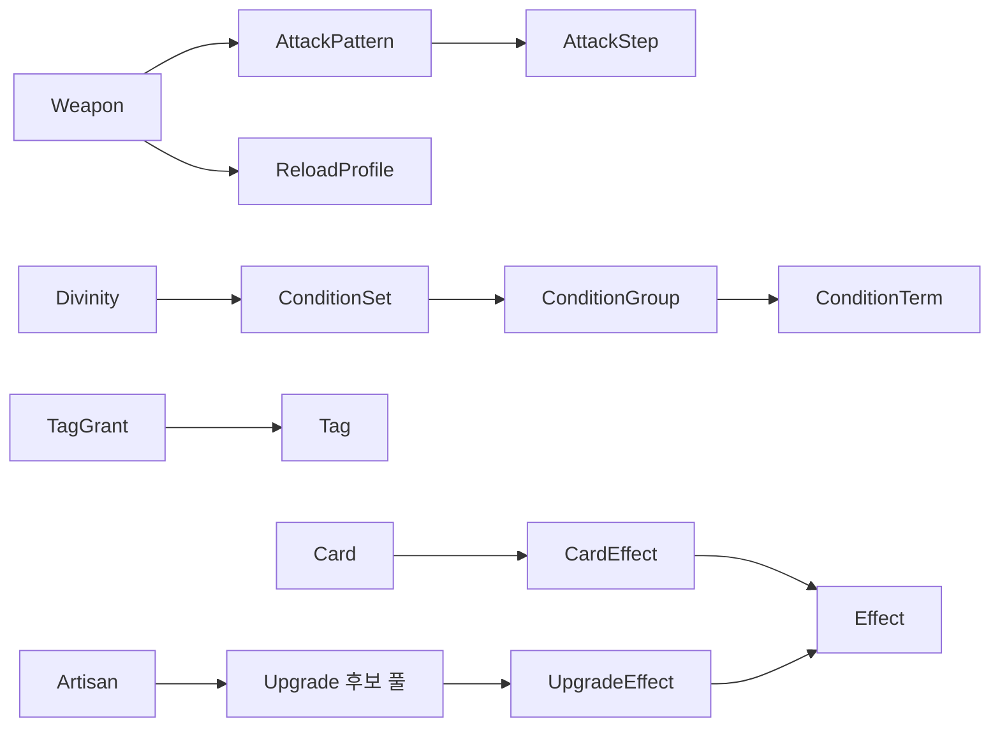

# 게임데이터 관계와 추가 절차
## 연결의 기본 구조

콘텐츠 행은 표시 이름이 아니라 ID로 연결한다. 문서는 각 ID 연결이 어떤 규칙을 만드는지 설명한다. 아래는 열 정의 초안을 이해하기 위한 구조 예시이며 실제 게임데이터 행이 아니다.

## 무기를 하나 추가하는 예

`weapon_example_greatsword`라는 예시 ID의 Weapon 행에서 `attack_pattern_id`로 `pattern_example_greatsword`를 가리킨다. AttackPattern은 공격 방식과 종료 공백을 정의한다. AttackStep에는 같은 pattern ID를 가진 1타, 2타와 3타 행을 추가한다. 연격 횟수는 이 행 수에서 구한다.

각 타격의 준비와 판정 및 후딜 시간은 해당 열에서 읽는다. 무기에 별도 총 연격 시간을 입력하지 않는다. 현재 공격속도 배율로 모든 타격 시간과 종료 공백을 나누고, 중단 대기는 같은 종료 공백을 참조한다. 연결 허용 시간은 CombatConfig의 열을 읽는다.

같은 연격을 쓰는 다른 무기는 패턴 ID를 공유할 수 있다. 타격 피해나 리듬이 달라지면 새 패턴 ID를 만들어 연결한다. 공유 중인 패턴 행을 바꾸면 연결한 모든 무기에 영향이 생기므로 영향을 받는 ID 목록을 확인한다.

## 카드와 태그를 추가하는 예

Card에 새 카드 ID를 만들고 효과는 CardEffect 행으로 연결한다. 번개와 감전의 태그를 주려면 TagGrant에 같은 카드 ID를 출처로 하는 두 행을 넣는다. 카드 효과 설명에 번개라고 써 놓는 것만으로 태그를 부여하지 않는다.

현재 장착 카드, 무기와 강화의 TagGrant를 집계해 조건 검사와 대장간 후보 구성에 사용한다. 카드 교체 시 제거한 출처의 점수도 함께 제거한다. 신성 효과를 자기 진입 조건에 포함할지 제외할지는 해당 기획 규칙을 따르며 Excel의 숫자만으로 결정하지 않는다.

## AND와 OR 조건을 추가하는 예

번개 요구량을 만족하면서 창 요구량 또는 감전 요구량을 만족하는 조건은 ConditionSet의 그룹 결합을 AND로 둔다. 첫 그룹은 번개 조건 하나, 두 번째 그룹은 창과 감전 조건의 OR로 둔다. 요구량은 ConditionTerm.number_value에서 읽는다.

이렇게 하면 설명 문구에 괄호를 넣거나 조건식을 자유롭게 타이핑하지 않고도 의미를 유지할 수 있다. 참조 중인 조건 세트에는 그룹과 개별 조건이 각각 하나 이상 존재해야 한다. 신성 진입, 성장과 강화 후보는 각자 조건 세트 ID를 참조한다.

## 다양성을 추가하는 두 경우

| 추가 내용 | 작업 방식 |
| --- | --- |
| 기존 연격의 피해와 시간 또는 외형이 다른 무기 | 새 콘텐츠 및 필요시 패턴 행, 관련 참조 추가 |
| 기존 효과를 다른 태그와 조건으로 조합한 카드 | 카드와 연결 및 조건 행 추가 |
| 기존 규칙으로 동작하는 신성 또는 장인 | 신성 또는 장인, 효과와 후보 및 조건 행 추가 |
| 새로운 공격 취소 방식이나 발동 사건 | 행동 규칙 문서와 허용값 및 지원 처리를 먼저 보강 |
| 새로운 종류의 효과 매개값 | 열의 뜻과 형식 및 검증 규칙을 먼저 추가 |

행을 늘려 가능한 다양성과 새 동작을 만들어야 가능한 다양성을 구분한다. Excel의 `effect_type`에 새로운 이름을 적는 것만으로 게임에 새 행동이 생기지는 않는다.

## 데이터 추가 절차 제안

1. 관련 기획 문서에서 사용할 분류와 기존 동작을 확인한다.
2. 고정 ID를 만들고 주 테이블에 행을 추가한다.
3. 효과, 태그, 조건과 보상 풀의 연결 행을 추가한다.
4. 필요한 수치와 외형 참조를 Excel에 입력한다.
5. 필수 열, ID 중복과 잘못된 참조 및 단위를 확인한다.
6. 연결한 규칙과 조건대로 동작하는지 훈련장에서 시험한다.
7. Excel의 데이터 버전과 시험 결과를 기록한다.

다른 시트의 이름 변경과 행 정렬로 ID 참조를 바꾸지 않는다. ID를 폐기할 때는 먼저 연결한 행을 찾고 대체 또는 제거한다. 활성 콘텐츠가 없는 ID를 가리키는 상태로 두지 않는다.

## Excel에서 게임으로 읽는 방식

게임에서 읽는 데이터의 생성 방식은 추후 결정한다. 초기 제안은 Excel의 논리 테이블을 검사한 뒤 게임이 읽을 수 있는 형태로 변환하고 원본과 변환 결과의 버전을 함께 관리하는 것이다. Excel의 화면 서식과 수식에 게임 규칙을 숨기지 않는다.

검사되지 않은 편집 파일이 곧바로 실행 데이터가 되지 않도록 작성, 검증과 반영의 단계를 구분한다. 현재 문서 작성으로 자동 변환이나 연결 기능이 구현된 것은 아니다.

## 남아 있는 결정

실제 파일과 시트 배치, ID 생성 규칙, 표시 이름과 외형 리소스의 관리 위치, 허용값 목록 및 필수 열, 수식 결과를 저장하는 방식, 게임의 읽기 형식과 검증 도구를 후속 데이터 작업에서 정한다.

## 문서 연결

상위 목차: [[00 MOC/게임데이터 MOC|게임데이터 MOC]]

관련 문서: [[00 MOC/게임데이터 MOC|게임데이터 MOC]] · [[05 검증과 확장/Excel과 기획 문서의 연결|Excel과 기획 문서의 연결]] · [[05 검증과 확장/게임데이터 열 정의|게임데이터 열 정의]]
