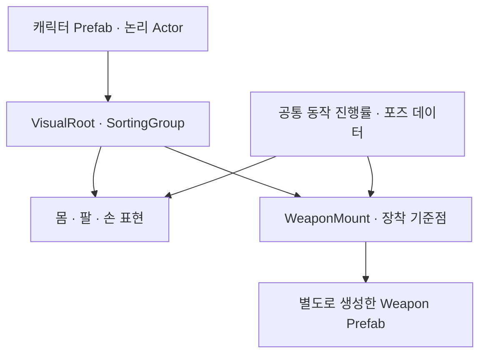

# 캐릭터와 무기 분리 제작

## 논의의 범위와 상태

2026-10-08 사용자가 제시한 방향은 **캐릭터와 무기를 별도로 생성하고, 인게임에서 각각의 Prefab을 생성하여 위치를 맞추고 동작시키는 방식**이다. 이번 요청에 따라 이 내용을 Vault에 정리했다. 아래의 기준점·레이어·데이터 구조와 제작 순서는 구현을 위한 추천안이며, 코드와 새 이미지로 적용하거나 품질을 검증한 상태는 아니다.

기존 [[07 Unity 기술/캐릭터와 무기 표현]]의 Actor와 WeaponView 분리 구상을 실제 이미지 제작과 장착 방법으로 구체화한다. 몸체 방향 수·무기 회전 방식·상하체 합성의 최종 선택은 T01, 픽셀 규격과 화면 크기는 T03에 남긴다. [[06 결정과 기록/현재 검토할 기획 질문]]

## 제작 단위

| 단위 | 포함할 내용 | 재사용 범위 |
| --- | --- | --- |
| 캐릭터 | 머리·몸통·하체, 팔과 손, 무기 계열별 포즈 | 캐릭터 정체성을 유지하면서 장비 외형 교체 |
| 무기 | 손이 포함되지 않은 무기 그림, 손잡이·보조손·끝 또는 발사구 기준점 | 호환하는 캐릭터와 같은 계열의 자세에 장착 |
| 동작 데이터 | 몸 프레임, 손 위치, 무기 각도·방향 그림, 앞뒤 표시 순서, 단계별 진행 | 호환하는 외형끼리 준비·타격·회수의 흐름 공유 |
| 효과 | 궤적·발사·타격 표현 | 전투 상태와 무기 계열에 따라 별도 표시 |

팔과 손은 캐릭터 쪽에 소속시킨다. 무기 원본에는 손·팔을 그려 넣지 않는다. 편집 레이어 수와 게임의 Renderer 수는 같을 필요가 없다. 몸·팔의 포즈를 함께 설계하고, 가림이나 교체에 필요한 부분만 런타임에서 분리한다.

캐릭터마다 모든 무기의 완성 시트를 다시 만드는 부담을 줄일 수 있다. 다만 대검·단검·창·활은 파지와 몸의 반응이 다르므로 계열별 자세가 필요하다. 프리팹 분리만으로 모든 무기가 같은 애니메이션을 사용할 수 있다고 가정하지 않는다.

## Prefab과 생성 수명

아래는 제안 구조이며 현재 Unity 씬의 실물 계층이 아니다.

1. 캐릭터를 생성하고 캐릭터 외형·무기 계열에 대응하는 포즈 세트를 선택한다.
2. 선택한 무기 Prefab을 생성하거나 풀에서 가져온다. 장착 지점의 자식으로 연결한다.
3. 주손 기준점과 무기의 손잡이 기준점을 맞추고 현재 상태의 포즈·정렬을 즉시 적용한다.
4. 장착 중에는 같은 무기 인스턴스를 유지한다. 매 공격마다 새 무기를 생성하지 않는다.
5. 허용된 장비 변경 시 기존 표현을 해제하고 새 무기 표현을 연결한다. 캐릭터 해제 시 무기 표현과 종속 효과도 정리한다.

풀 사용은 구현 선택이다. 소수 무기의 첫 비교에는 일반 생성·해제로 시작할 수 있다. 장비를 바꾸는 기능이 런 중 주무기 교체를 허용한다는 뜻은 아니다. 현재 기획의 시작 무기 선택·훈련장 비교와 안전한 변경 경계를 따른다. [[03 빌드와 무기/덱과 성장 보강 기준]]

무기 Prefab의 교체로 논리 장비의 쿨타임·자원·세대 ID가 초기화되지 않도록 WeaponRuntime과 WeaponView의 책임을 구분한다. 공격 취소·사망·재사용 시 진행 중 궤적과 이전 장비 참조를 해제하는 구체적인 처리는 구현 대상이다. [[02 전투/전투 사건과 자원 및 방 전환 기준]]

## 기준점과 크기

| 기준점 | 소속 | 용도 |
| --- | --- | --- |
| 발 기준 | 캐릭터 | 월드 위치·접지·다른 Actor와의 정렬 기준 |
| 주손 기준 | 캐릭터 포즈 | 현재 포즈에서 무기를 잡는 위치와 방향 |
| MainGrip | 무기 | 주손과 일치시킬 손잡이 위치·기준축 |
| OffGrip | 무기 | 양손 파지에서 보조손을 맞출 위치·방향 |
| Tip / Muzzle | 무기 | 궤적 끝·발사 효과의 시각 기준. 공격 판정의 원본은 아님 |

이름은 설명용이며 코드 타입·필드명은 미확정이다. 이미지 중앙을 공통 손잡이로 가정하지 않는다. MainGrip을 루트 원점으로 제작하거나, 별도 기준점의 역변환을 적용해 주손에 정렬할 수 있다. 위치만 맞추는 것 외에 방향·축·배율과 좌우 반전 방식도 정의한다.

이미지의 캔버스 크기는 달라도 된다. 같은 월드에서 쓰는 픽셀 밀도, 시점, 윤곽선과 광원 기준을 공유한다. 무기 크기는 가능하면 원본 픽셀과 장착 규격에서 설계하고, 비정수 Transform 배율로 늘렸을 때의 픽셀 불균형은 실제 화면에서 판단한다.

## 포즈와 공격 동기화

몸 프레임과 무기 궤적은 하나의 전투 단계와 진행률을 읽는다. 독립 Animator를 각자 시작하여 경과 시간을 따로 누적하는 방식으로 손과 무기의 연결을 맡기지 않는다. 준비 중 조준 갱신, 실행 시 방향 고정과 공격속도 적용은 기존 전투 규칙을 따른다.

한 포즈 샘플에서 몸 프레임·주손 위치·무기 방향·앞뒤 순서를 함께 결정한다. 첫 구현은 프레임별 기준점을 직접 작성하는 방식을 추천한다. 곡선 보간과 프레임 교체를 혼합할 경우 손이 붙어 있는 것처럼 보이는지 확인해야 한다.

양손 무기는 같은 무기 계열의 손잡이 간격에 맞는 보조손 포즈를 제작한다. 무기의 OffGrip을 확인하며 포즈를 선택·보정하되, 팔과 무기가 서로를 따라가도록 순환 의존을 만들지 않는다. 크게 다른 손잡이 간격에는 별도 포즈나 보정이 필요하다. 자동 관절 계산(IK)은 추가 비교 후보이며, 픽셀 팔다리의 임의 회전·늘어남을 기본 해결책으로 확정하지 않는다.

하체 이동과 상체 공격을 합성하려면 골반 기준과 호환 포즈를 마련한다. 무기 교체 기능을 만드는 것과 이동 중 공격의 상하체 분리를 완성하는 것은 각각의 구현 과제다.

## 앞뒤 가림과 픽셀 회전

- SortingGroup 아래에서 몸·손·무기의 내부 표시 순서를 관리한다. 서로 다른 캐릭터의 부품이 섞이는 것을 줄이는 용도다.
- 앞손·뒤손과 무기 순서는 방향 및 공격 포즈별로 정한다. 항상 위 방향만 무기를 뒤로 보내는 규칙으로 제한하지 않는다.
- 긴 무기의 일부가 몸 앞, 일부가 몸 뒤에 있어야 하는 포즈는 앞/뒤 조각 또는 마스크가 추가로 필요하다. 단일 Sprite의 sortingOrder 변경만으로 양쪽을 동시에 표현할 수는 없다.
- 연속 회전은 조준 대응과 재사용에 편리하지만 저해상도 칼날의 윤곽이 흔들릴 수 있다. 각도별 그림은 제작량이 늘며 보간과 방향 전환도 다뤄야 한다. 중요한 각도만 별도로 그리는 조합도 비교한다.
- 논리 조준은 연속 벡터로 유지한다. 몸 그림을 4/8방향으로 제한하더라도 실제 조준·판정 방향까지 자동으로 제한하지 않는다.

그룹 정렬은 긴 무기와 다른 Actor 사이의 모든 기하학적 가림까지 해결하지 않는다. 지면 효과·독립 투사체의 정렬은 [[07 Unity 기술/캐릭터와 무기 표현#깊이와 가림|깊이와 가림]]을 따른다. [Unity SortingGroup](https://docs.unity3d.com/kr/current/ScriptReference/Rendering.SortingGroup.html)

## 이미지 생성과 원본 제작

1. 무기 없는 기준 캐릭터를 생성하여 비율·의상·정체성을 정한다. [[07 Unity 기술/캐릭터 비율과 픽셀 아트 제작]]
2. 동일한 스타일 기준을 참조해 손이 포함되지 않은 무기만 따로 생성한다. 무기의 원근·광원·윤곽선·명암을 캐릭터와 맞춘다.
3. 투명 배경의 각 출력을 실제 게임 크기로 합성한다. 손잡이 위치, 칼날 크기와 공격 공간을 비교한다.
4. 선택한 캐릭터와 무기에 맞춰 준비·타격·회수의 몸과 손 포즈를 설계한다. 생성 시점의 분리와 포즈 설계의 조율을 함께 유지한다.
5. Aseprite에서 픽셀 격자·팔레트·알파·기준점을 정리하고 편집 원본과 게임용 출력·메타데이터를 보관한다.

생성 이미지가 자동으로 원하는 픽셀 크기·정확한 기준점·방향 일관성을 갖는다고 가정하지 않는다. 최종 기준 그림을 참조하여 한 항목씩 수정한다. 캐릭터에 그려진 무기를 지워 레이어로 나누는 제작 경로를 기본으로 삼지 않는다.

## 데이터의 책임

기존 후보인 ActorVisual·WeaponVisual·ActionVisual·Resource 관계를 활용한다. 새로운 Excel 테이블을 확정하거나 수치 행을 만드는 작업은 이번 범위에 포함하지 않았다. [[07 Unity 기술/기술 검증과 제작 순서#데이터 연결 후보|데이터 연결 후보]]

| 정의 | 필요한 정보의 후보 | 읽는 시점 |
| --- | --- | --- |
| ActorVisual | 캐릭터 Prefab 리소스 ID, 호환하는 무기 계열별 포즈 세트 | 캐릭터 생성·장착 |
| WeaponVisual | 무기 Prefab 리소스 ID, 기준점, 호환 포즈 계열, 각도별 그림 | 장착·방향 표시 |
| ActionVisual | 동작 ID·전투 motion_id 연결, 몸 프레임·손 위치·무기 각도·정렬 샘플 | 전투 단계의 시각 샘플링 |

기준점의 좌표계·단위는 원본 픽셀 좌표와 Unity 로컬 단위를 혼용하지 않게 내보내기 규약에서 정한다. 실제 포즈 좌표는 제작 리소스로 관리하고, 게임 수치·고정 콘텐츠 ID·실행 중 핸들을 구분한다. [[05 검증과 확장/게임데이터 열 정의]] · [[05 검증과 확장/Excel과 기획 문서의 연결]]

사거리·피해·유효 시간은 기존 전투 정의가 원본이다. 시각 무기 크기나 소켓 편집만으로 판정이 자동 변경되지 않게 한다. 보이는 칼날과 실제 공격이 어긋나면 아트 또는 전투 수치를 명시적으로 조정하고 다시 확인한다.

## 현재 구현과 다음 비교

프로젝트의 Hero V2는 64×64 셀, 4방향, 방향별 16프레임의 중간 구현이다. 몸·팔과 무기·그림자·효과를 출력하지만 **팔과 무기는 같은 이미지이며**, 전신 포즈가 공격 중 교체된다. 이 문서의 별도 무기 Prefab과 기준점 구조가 이미 적용된 것으로 취급하지 않는다.

기존 구현과 당시 확인 기록은 [project2D의 Hero V2](https://github.com/SeoS4090/project2D/tree/42628ea35be214b5d51de63d8ffa745cdd7dbd77/Assets/Art/Characters/HeroV2), [기존 검증 기록](https://github.com/SeoS4090/project2D/blob/42628ea35be214b5d51de63d8ffa745cdd7dbd77/Screenshots/HeroV2/Verification.md)에서 확인한다. 아래 새 제작 시험은 모두 미실시다.

- [ ] 캐릭터 하나에 같은 계열의 대검 외형 두 개를 장착하여 손 연결과 크기 차이를 확인한다.
- [ ] 준비·타격·회수와 앞·뒤 방향에서 무기·손·몸의 연결과 가림을 확인한다.
- [ ] 이동·공격속도 변경·취소·사망 시 몸과 무기 표현이 같은 상태를 따른다.
- [ ] 장착·해제·재사용으로 무기나 효과가 중복되거나 이전 상태가 남지 않는다.
- [ ] 단검 또는 창의 계열별 자세를 추가해 재사용 범위와 추가 제작량을 확인한다.
- [ ] 실제 게임 크기에서 회전 방식과 픽셀 밀도, 보이는 공격과 판정을 비교한다.

시험용 대검 두 개는 비교 범위 제안이며 실제 콘텐츠 수량의 확정값이 아니다. T01의 방향 수·회전·포즈 합성 선택과 T03의 아트 스케일은 결과를 보고 결정한다.
