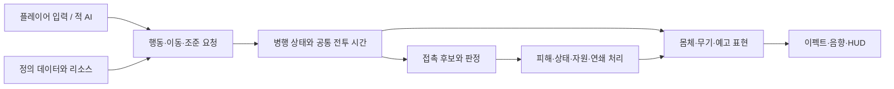

# 프레임워크 구조

## 목적과 상태

캐릭터·적·무기를 같은 전투 규칙으로 실행하고, 무기와 신화 양식·권능이 달라져도 연출 리소스와 데이터로 확장한다. 사용자가 지정한 Unity 6.3 LTS `6000.3.18f1`와 URP 2D는 확정 기준이다. 아래 모듈 명칭·배치·구현 방식은 추천 초안이며 코드 작성 완료나 사용자 개별 채택으로 표현하지 않는다.

Unity 6.3 URP는 2D 조명과 Pixel Perfect Camera 등 2D 표현 기능을 제공한다. 캐릭터·환경은 Sprite Lit, 상태 표시·위험 경계는 조명으로 가독성이 사라지지 않는 표현을 우선 시험한다. [Unity 6.3 공식 안내](https://docs.unity.com/en-us/engine/6000.3/manual/unity2d/2d-urp)

## 책임의 구성

| 영역 | 추천 모듈 | 책임 |
| --- | --- | --- |
| 세션 | GameSession, RoomContext | 런·방·정지·전환, 생성과 정리, 체크포인트 |
| 정의 | DefinitionCatalog | Excel에서 변환한 정의·ID와 Unity 리소스 참조 검증 |
| 캐릭터 | ActorFactory, ActorRuntime | 생성, 소유권·식별자, 능력치·자원·장비·상태 |
| 의사결정 | PlayerInputAdapter, EnemyBrain | 같은 형식의 이동·조준·행동 요청을 생성 |
| 시간과 행동 | CombatClock, MotionController, ActionController | 타임라인·스냅샷·예약·병행 상태와 단계 전환 |
| 판정 | HitQuery, CombatResolver, EffectSystem | 접촉 후보, 차폐·중복·방어·피해·상태·연쇄 |
| 화면 | ActorView, WeaponView, CombatVfxService, StatusVisualController | 확정 상태·사건에 대응하는 그림·소리·HUD |
| 도구 | DebugOverlay, ContentValidator | 상태·ID·판정·자원·데이터 계약을 관찰·검증 |

입력·AI → 행동 요청 → 전투 상태와 시간 → 이동·접촉 후보 → 피해·상태 결정 → 화면 반영 순서로 연결한다. 생성 순서가 바뀌어도 각 MonoBehaviour의 임의 Update 순서에 전투 우선순위를 맡기지 않는다. 초기에는 명시적 조합의 GameObject/MonoBehaviour와 일반 C# 객체로 만들며 ECS나 대형 DI 프레임워크의 도입 여부는 실제 병목과 확장 요구가 생긴 뒤 판단한다.

## 캐릭터는 여러 상태를 함께 가진다

| 채널 | 예시 | 분리 이유 |
| --- | --- | --- |
| 생명·제어 | 살아 있음·출현·기절·사망 | 새 행동 허용과 강제 종료를 공통 제약으로 제공 |
| 이동 | 걷기·대시·밀려남 | 공격 중에도 이동 또는 강제 이동이 가능 |
| 공격 행동 | 대기·준비·실행·후딜·연격 공백, 특수행동 | 대시와 별개 진행, 특수행동은 현재 타격 후 전환 |
| 조준 | 입력 방향·관측 목표·실행 방향 | 준비 추적과 실행 고정, 몸체 방향과 연속 방향 구분 |
| 자원·기간 상태 | 마나·충전·장탄·쿨타임·면역·버프 | 행동과 병행해 진행하며 정지·전환의 유지 계약 적용 |

전역 단일 상태 열거형을 `DashAttackKnockback`처럼 모든 조합으로 늘리지 않는다. 병행 채널이 각각 진행하되 하나의 허용·취소 판단이 기존 C·D·U 규칙을 적용한다. 사망은 전체 종료, 기절은 단계별 제약, 순수 밀려남은 공격 유지다. 애니메이션의 전환 가능 여부가 전투 규칙을 결정하지 않는다.

[[02 전투/전투 상세 처리와 의문점 정리]] · [[02 전투/전투 사건과 자원 및 방 전환 기준]]

## 시간·애니메이션·충돌의 계약

전투는 하나의 멈출 수 있는 게임 시간을 사용한다. 논리 처리는 고정 간격을 추천하지만 실제 간격은 후속 측정이다. 고정 간격 한 번 안에서도 입력·대시 시작·판정·상태 만료의 시각 순서를 보존한다. 서로 다른 시각을 같은 물리 프레임이라는 이유로 동시 사건으로 묶지 않는다. 비용·회복·피격 순서는 D04와 U07을 따른다.

타격은 준비→실행→후딜의 게임 타임라인을 가지며, 활성 판정 구간·연출 큐를 그 시간에 매핑한다. 공격속도 스냅샷의 동일 배율로 전체 사이클과 해당 표현을 구동한다. Animator 또는 프레임 재생기는 논리 진행값을 표현한다. Animation Event만으로 피해·비용·쿨타임을 생성하지 않아 프레임 생략·비활성화·보이지 않는 적의 애니메이션 최적화가 게임 결과를 바꾸지 않도록 한다.

Physics2D는 이동 차폐와 접촉 후보 조회의 도구로 사용한다. 스프라이트 무기 Collider와 렌더러가 피해 원본이 되지 않는다. 빠른 이동·판정 구간을 건너뛴 타격은 구간 이동 궤적을 검사하고 실제 접촉 시각 또는 정의한 근사 오차를 검증한다. 근접 판정 원점은 현재 캐릭터 위치를 따르고, 실행 방향은 고정한다. 물리 엔진 사용만으로 플랫폼 간 결정론을 보장하지 않는다.

실행 ID·적중 단위·대상 ID·logical source·root를 별도로 유지한다. 전투 Resolver가 방어·피해·상태를 처리하고 화면에는 `HitResolved`, `ActionPhaseChanged`, `StatusChanged` 같은 관찰 사건을 보낸다. VFX 실패나 품질 저하가 피해 생성을 막지 않는다. 화면 재생 중복과 gameplay 적중 중복은 별도 키로 관리한다.

## 생명주기와 저장

ActorFactory는 정의 검증 → 논리 인스턴스/세대 ID 발급 → 자원·능력치·장비·상태 초기화 → View 연결 → 방 등록 → 표시 순서로 생성한다. 풀에서 재사용해도 이전 세대의 지연 사건이 새 적을 건드리지 않도록 인스턴스 세대를 검증한다. 정의가 없거나 참조가 잘못되면 공격 가능한 빈 캐릭터를 생성하지 않고 제작 진단을 남긴다.

사망·방 전환은 사건 처리를 마친 뒤 명시적 순서로 논리 소유권·표시·풀을 정리한다. 이미 발생한 독립 투사체는 해당 규칙대로 유지할 수 있으므로 캐릭터 자식의 비활성화로 함께 없애지 않는다. 풀 반환 때 이벤트 구독·예약·머티리얼 상태·잔상·예고·적중 기록을 해제한다. 저장은 GameObject나 머티리얼 대신 논리 ID·남은 시간·RNG·유지 상태를 U14/R02대로 기록한다.

초기 표현 객체·투사체는 Unity ObjectPool 계열의 재사용 구조를 후보로 삼는다. 실제 제한과 대여 실패 정책은 게임 논리와 장식을 구분해 검증한다. [Unity ObjectPool](https://docs.unity3d.com/6000.3/Documentation/ScriptReference/Pool.ObjectPool_1.html)

## 데이터와 폴더

Excel은 전투 값·콘텐츠 행의 작성 원본이다. Unity ScriptableObject나 생성한 데이터 파일은 변환 산출물·리소스 매핑으로 사용하고 두 군데서 전투 값을 수동 수정하지 않는다. HP·예약·쿨타임을 공유 정의 에셋에 저장하지 않는다. Unity Prefab·Sprite·Material은 아트 제작 원본으로 유지하고 Resource ID로 연결한다.

추천 코드 경계는 `Game.Core`(정의·상태·전투 계약), `Game.Unity`(입력·물리·오브젝트 연결), `Game.Presentation`(표현), `Game.Editor`(변환·검증)다. 최초부터 모든 클래스를 각각 asmdef로 나누지 않는다. Core는 화면 셰이더나 Animator의 존재를 요구하지 않는다. 상세 리소스 후보는 [[07 Unity 기술/기술 검증과 제작 순서]]에서 관리한다.
